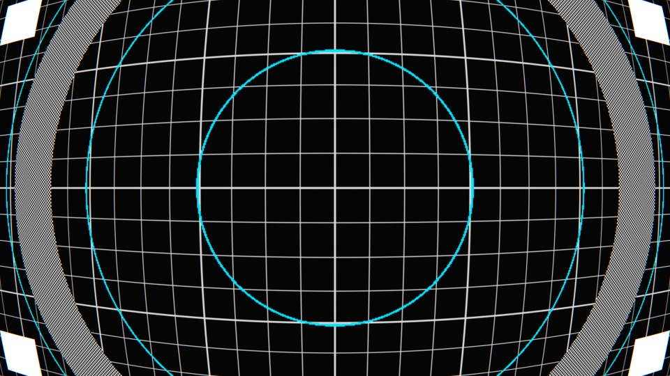
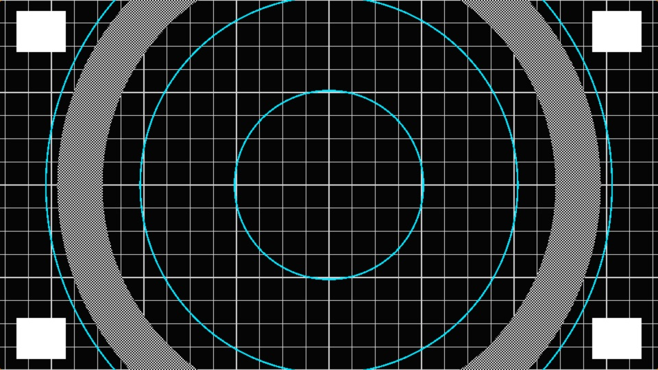
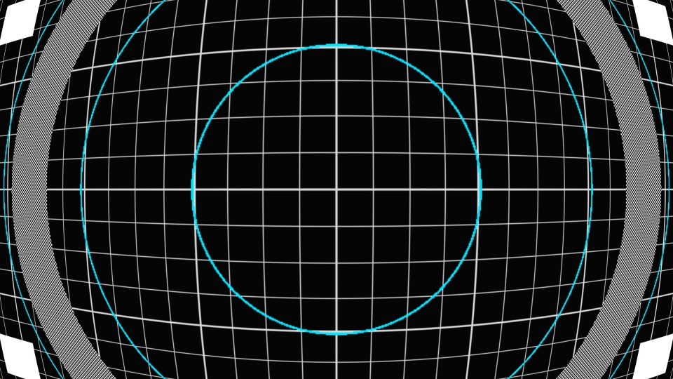
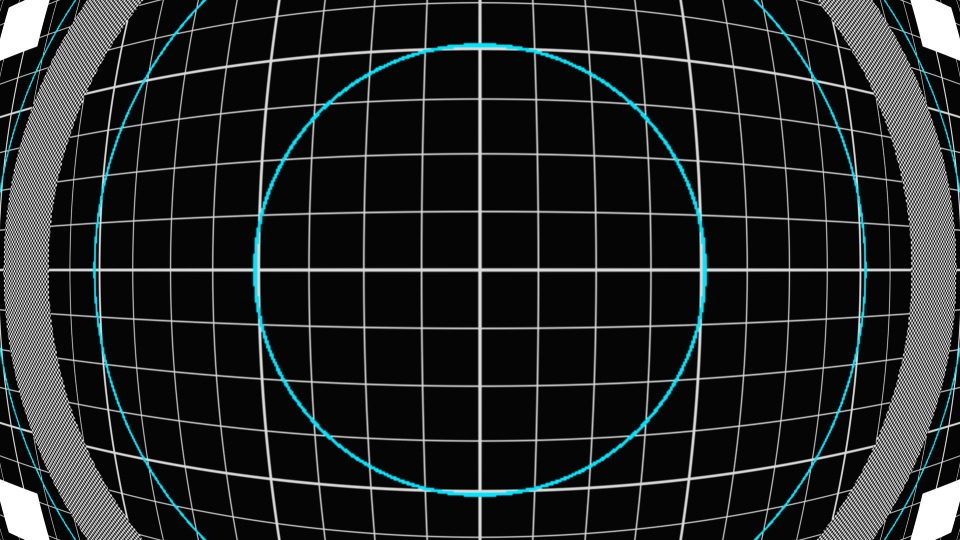
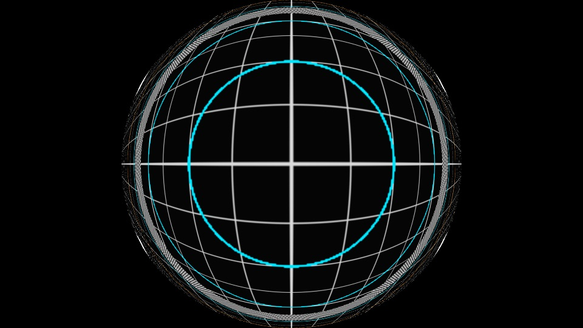
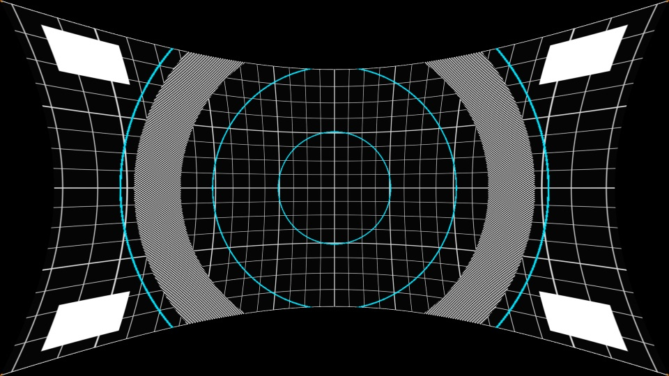

# Porthole

> **AI-assisted project.** This codebase was created with [Claude](https://claude.com/claude-code)
> (Anthropic), directed and reviewed by a human author. The projection maths is
> verified numerically by an offline harness that drives the real plugin class in
> a headless GL context: the GLSL is measured against an independent C++
> implementation across 120 parameter combinations, and the defish is confirmed
> to invert the fish to within 0.001 of an 8-bit level (see [Status](#status)).
> It has **never been loaded into Resolume** — only compiled, rendered and
> measured offline. Check it in your own rig before trusting it in a show.

A variable fisheye and defish warp for [Resolume](https://resolume.com) Arena and
Avenue, as an FFGL effect.

**Video:** [What it does, in 45 seconds](https://www.youtube.com/watch?v=BJjHqfk8XB8)



<sub>The repo's geometry test card through the default lens. The grid shows the
shape of the distortion, the rings confirm the map stays radial, and the frame
stays full — rendered by `phtest`, the offline harness.</sub>

Porthole does not draw a bulge. It **re-photographs the picture through a
different lens**: every output pixel stands for a ray at some angle off the
optical axis, the lens model says where a ray at that angle lands on the image,
and the picture is resampled accordingly.

That distinction is the whole point, because it means the Projection control is
not a strength knob — it is *which lens*. The slider is a single continuous
family that passes exactly through all five projections that have names:

| | |
| --- | --- |
|  |  |
| **Rectilinear**, `r = tan θ` — an ordinary lens, and the identity | **Stereographic**, `r = 2 tan(θ/2)` — "little planet", preserves angles |
|  |  |
| **Equidistant**, `r = θ` — the classic fisheye | **Orthographic**, `r = sin θ` — the mirror-ball |

Three things follow from modelling it this way rather than fitting a curve that
looks about right, and all three are consequences rather than features:

| What you get | Why |
| --- | --- |
| **Rectilinear does nothing at all**, at any field of view | A flat picture re-photographed through a flat lens is the same picture. The maths says so without being told. |
| **Defish exactly undoes fish** | It is the same formula with source and destination swapped, not a similar-looking inverse curve. Measured at 0.001 of a level. |
| **The frame always stays full** | The reference radius is a fixed point of the map. Only the interior is redistributed, so strength changes the *character* of the warp instead of shrinking the picture into a black field. |



<sub>The same card, defished. Pincushion instead of barrel, and the transparent
corners are honest: undoing a fisheye genuinely wants picture from beyond the
frame, and there is none.</sub>

There is deliberately **no wet/dry mix**. Cross-fading two different geometries
double-exposes the picture rather than easing between them. The null is Field of
View at zero, where every projection agrees anyway.

## Try it in your browser

**<https://porthole-demo.stoatworks-labs.com>**

Not the plugin — the GLSL from `source/Shaders.cpp`, copied across unedited and run in
WebGL2 over clips generated in the page, with the parameters this plugin's
constructor declares and the conversions its own code applies. No install, and
nothing you load leaves your machine.

Two of the claims below are checkable there in a few seconds: set Projection to rectilinear and the picture is untouched at any field of view, and turning Defish on with nothing else changed puts a fisheye back flat.

It is a port, so it is not evidence about the plugin: a browser is not Resolume,
GLSL ES 3.00 is not desktop GL 4.1 core, and nothing on that page measures
anything. The page says all of that itself, in a disclosure at the foot. The
numbers worth trusting are in [Status](#status) and come from the offline
harness in this repository.

<!-- downloads:start -->

## Download

**[v1.0.2](https://github.com/stoatworks-labs/porthole/releases/tag/v1.0.2)** — prebuilt for macOS and Windows. Pick your platform:

<details>
<summary><b>macOS</b> — Universal (Apple Silicon + Intel)</summary>

| Build | Download | Size |
| --- | --- | --- |
| Universal (Apple Silicon + Intel) · .dmg disk image | [`porthole-1.0.2-macos-universal.dmg`](https://github.com/stoatworks-labs/porthole/releases/download/v1.0.2/porthole-1.0.2-macos-universal.dmg) | 201 KB |
| Universal (Apple Silicon + Intel) · .zip archive | [`porthole-macos-universal.zip`](https://github.com/stoatworks-labs/porthole/releases/latest/download/porthole-macos-universal.zip) | 157 KB |
| Universal (Apple Silicon + Intel) · .zip archive (OpenFX — Resolve, Vegas, Nuke) | [`porthole-ofx-macos-universal.zip`](https://github.com/stoatworks-labs/porthole/releases/latest/download/porthole-ofx-macos-universal.zip) | 236 KB |

</details>

<details>
<summary><b>Windows</b> — x64</summary>

| Build | Download | Size |
| --- | --- | --- |
| x64 · .exe installer | [`porthole-1.0.2-windows-x86_64-setup.exe`](https://github.com/stoatworks-labs/porthole/releases/download/v1.0.2/porthole-1.0.2-windows-x86_64-setup.exe) | 212 KB |
| x64 · .zip archive | [`porthole-windows-x86_64.zip`](https://github.com/stoatworks-labs/porthole/releases/latest/download/porthole-windows-x86_64.zip) | 103 KB |
| x64 · .zip archive (OpenFX — Resolve, Vegas, Nuke) | [`porthole-ofx-windows-x86_64.zip`](https://github.com/stoatworks-labs/porthole/releases/latest/download/porthole-ofx-windows-x86_64.zip) | 67 KB |

</details>

All builds, checksums and release notes: [github.com/stoatworks-labs/porthole/releases](https://github.com/stoatworks-labs/porthole/releases).

macOS builds are signed and notarised and open normally. The Windows builds are unsigned, so SmartScreen warns once.

<!-- downloads:end -->

## OpenFX — Resolve, Vegas, Nuke, Natron

The same effect also builds as an OpenFX plugin, so it runs in DaVinci Resolve
(Edit and Color pages, and Fusion), Vegas Pro, Nuke and Natron. It is
the identical lens family — the OpenFX build links the same Projection.cpp the probe measures the shader against.

Grab the `porthole-ofx-*` zip for your platform from the release and copy
`Porthole.ofx.bundle` into the standard OpenFX folder, then restart the host:

```
macOS    /Library/OFX/Plugins/
Windows  C:\Program Files\Common Files\OFX\Plugins\
```


## Controls

**Lens**

| Control | What it does |
| --- | --- |
| **Projection** | Which lens. Rectilinear at 0, stereographic at 0.25, equidistant at 0.5, equisolid at 0.75, orthographic at 1. Everything between is a real projection too. |
| **Field of View** | How wide an angle the frame spans, up to 178°. This is the strength: at zero every projection agrees and nothing happens. |
| **Defish** | Swap the direction. Off warps a flat picture into a fisheye; on takes a fisheye picture flat again. |
| **Chromatic** | Lateral chromatic aberration — the same lens at three slightly different scales, growing with the square of the radius the way real glass does. Independent of distortion, because a lens can have one without the other. |

**Frame**

| Control | What it does |
| --- | --- |
| **Fit** | Where the reference circle touches. *Diagonal* pins the corners (the photographic convention), *Width* and *Height* pin those edges, *Stretch* drops the aspect correction so the circle becomes an ellipse filling the frame. |
| **Centre X / Y** | Move the optical axis off centre. |
| **Zoom** | Magnify about the axis, two stops either way. |

**Output**

| Control | What it does |
| --- | --- |
| **Edges** | What to show where the lens has no picture to draw on: Transparent, Black, Clamp, Mirror or Wrap. |
| **Quality** | Samples per pixel: 1, 4 or 16 on a rotated grid. A wide fisheye minifies its outer band hard, and one sample per pixel aliases there badly. |

## Install

Build (see below) or take a release, then drop `Porthole.bundle` (macOS) or
`Porthole.dll` (Windows) into Resolume's plugin folder:

```
~/Documents/Resolume Arena/Extra Effects
```

`Avenue` instead of `Arena` for that edition. On macOS `cmake --install build`
does it for you. The releases are unsigned — see [docs/UNSIGNED.md](docs/UNSIGNED.md).

## Build

```bash
git clone --recursive https://github.com/stoatworks-labs/porthole
cd porthole
cmake -B build -DCMAKE_BUILD_TYPE=Release
cmake --build build
```

macOS needs nothing beyond the system OpenGL framework. Windows needs GLEW,
which the bundled `vcpkg.json` will fetch.

The macOS build is universal (arm64 + x86_64) by default so it loads in both
builds of Resolume. Add `-DCMAKE_OSX_ARCHITECTURES=arm64` for a faster dev
build, and check the artefact rather than the log:

```bash
lipo -archs build/Porthole.bundle/Contents/MacOS/Porthole
```

## Status

A warp is unusually testable, because where a pixel went is a number rather than
a matter of taste. `tools/verify.sh` runs the lot.

| Check | Result |
| --- | --- |
| **GLSL against C++**, 120 combinations of fit × projection × field of view × direction | agree to **0.6 of an 8-bit level**, which is the quantisation of the test ramp rather than the maths |
| **Fish → defish round trip**, 64 combinations | **0.001 levels** mean error at moderate settings; 16 of the 64 are too extreme to judge and say so rather than claiming a pass |
| **Dead-control sweep** | all 10 parameters measurably affect the output |
| **Universal binary** | `x86_64 arm64`, exports `plugMain` |
| **Loaded in Resolume** | **no — never once** |
| **Windows build** | never compiled |
| **Performance** | never measured |

The lens maths deliberately exists twice — in C++ for readability and testing,
in GLSL because it has to run per pixel. `phtest --probe` feeds in a picture
whose brightness *is* the normalised radius, so what comes back out states which
source radius the GPU actually sampled from, and compares it against the C++.
That is what makes the duplication safe.

Both measurements decline to answer where the picture cannot support the
question — a radius that falls outside the frame, or a region the fish already
compressed past 2:1 — rather than reporting a failure that is really physics.

## Diagnostics

If the effect appears in Resolume but does nothing, the shader did not compile.
That is silent from the host's side, so it is logged:

```
~/Library/Logs/porthole/porthole.<date>.log
```

<!-- attributions:start -->
This project is built on other people's work — see [ATTRIBUTIONS.md](ATTRIBUTIONS.md).
<!-- attributions:end -->

## Licence

MIT — see [LICENSE](LICENSE).
